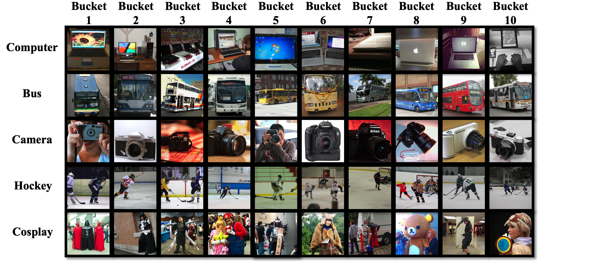

## Overview

Existing continual learning (CL) benchmarks, such as Permuted-MNIST and Split-CIFAR, are artificially made and do not generalize to real-world CL applications. In this work, we propose CLEAR, the first continual image recognition benchmark dataset with a natural **temporal evolution of visual concepts**. We argue that temporally-evolving visual concepts offer a more realistic CL scenario with **smooth** transitions between distributions. Our contributions are twofold: (1) To build CLEAR out of the largest existing public image collection (YFCC100M), we introduce a new low-cost "visio-linguistic-based" dataset curation method by making use of recent zero-shot vision-language models (OpenAI's CLIP) to dramatically decrease annotation cost, allowing us to create real-world CL datasets that span a **decade** (2) CLEAR is further post-processed by crowd-sourced validation (Amazon MTurk) to remove misclassified and inappropriate images originally hidden in YFCC100M image collection. The major strengths of CLEAR over prior CL benchmarks include (1) smooth temporal evolution of visual concepts in CLEAR enables a novel and more practical "online" evaluation protocol for continual learning algorithms, which is to "train now and test in the future" (2) CLEAR contains complex real-world imagery (not object-centered, e.g., CIFAR and ImageNet) and is more relevant to real-world applications (3) besides high-quality labeled data, CLEAR offers abundant unlabeled samples for each time period for continual semi-supervised and unsupervised learning. 

### Data download 

[Google Drive](https://drive.google.com/file/d/1xj5DCYr502SlvoF0INCL1n-gbxi0Kr3v/view?usp=sharing)

### Team
This dataset is created by team in [CMU Argo AI Center for Autonomous Vehicle Research](https://labs.ri.cmu.edu/argo-ai-center/)

### License
[CC BY](https://creativecommons.org/licenses/by/4.0/)

